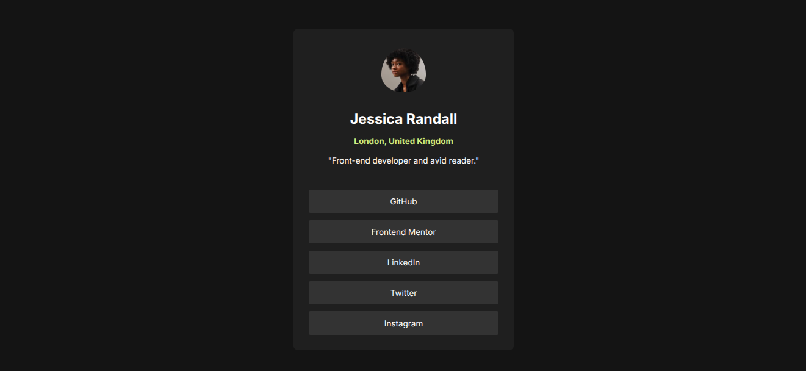

# Frontend Mentor - Social links profile solution

This is a solution to the [Social links profile challenge on Frontend Mentor](https://www.frontendmentor.io/challenges/social-links-profile-UG32l9m6dQ). Frontend Mentor challenges help you improve your coding skills by building realistic projects. 

### Screenshot

### Links

- Solution URL: [https://github.com/CoderAlchemy24/frme-social-links.git](https://github.com/CoderAlchemy24/frme-social-links.git)
- Live Site URL: [https://aquamarine-pudding-539cb0.netlify.app/](https://aquamarine-pudding-539cb0.netlify.app/)

## Author

- Website - [https://github.com/CoderAlchemy24/frme-social-links.git]

